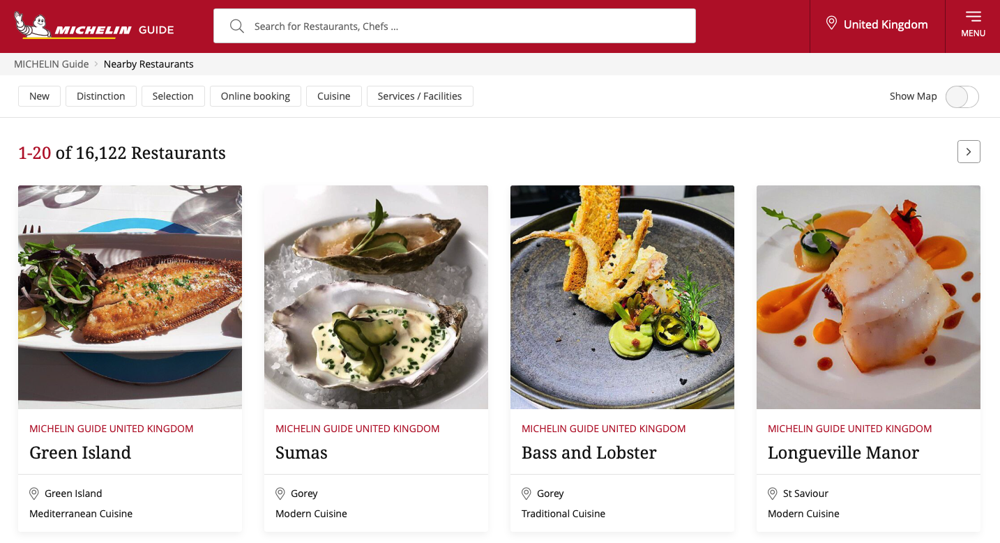
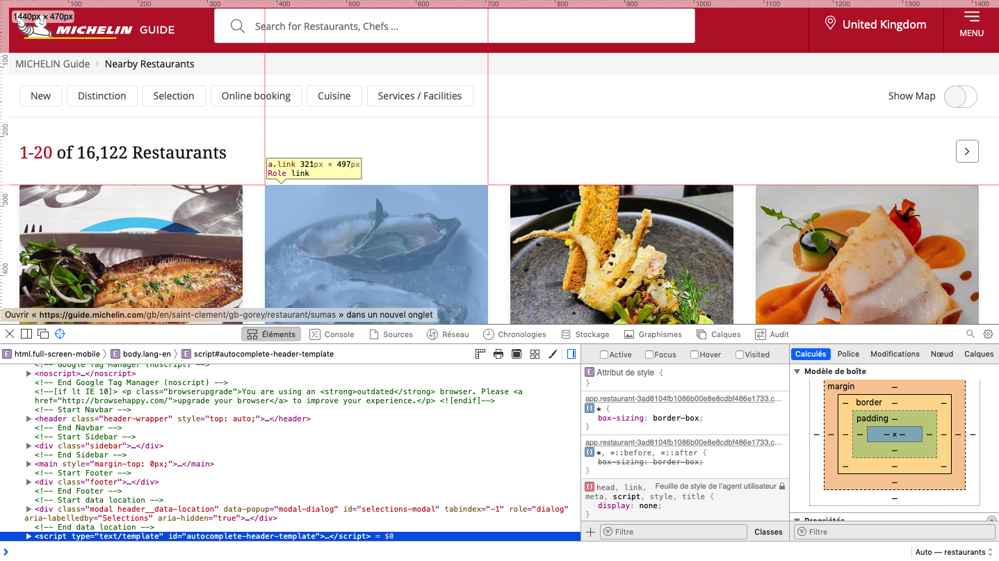
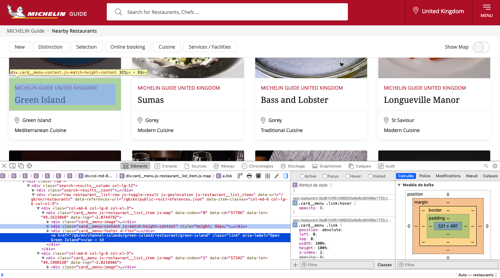

```{r setup, include=FALSE, echo=FALSE}

library(formatR)
knitr::opts_chunk$set(echo = TRUE
                      ,eval = TRUE
                      ,include = TRUE
                      ,message = FALSE
                      ,warning = FALSE
                      ,fig_caption = FALSE
                      ,out.width = "80%"
                      ,fig.align = "center"
                      # ,tidy = TRUE
                      ,cache = FALSE)

```

# Introduction

Sometime, you can find intresting data for a project on the web, and quite often it will be possible to download the raw dataset,like a spreadsheet, csv or json, for your own use. However, this is not always the case. And in these kind of cases, there is always the possibility to try web-scrapping. While it can seem like a lengthy extra step towards the realization of your intended idea, it can also give you the opportunity to develop a new skill, and undertand better how websites work in general.   
Web scrapping is generally legal, so you shouldn't feel like you are doing something wrong when scrapping data. Occasionally, some web sites will have protection against it, but you still can manage to get what you want.
This post will show an example of using the [**rvest**](https://rvest.tidyverse.org) package ( another great package from the **tidyverse** team) to scrap data from the 
website of [michelin restaurants](https://guide.michelin.com/gb/en). Their data is not accessible online in raw format, so we have a true real-world case in hands.

# Set up

Let's include the libraries needed for this task.

```{r }

library(tidyverse)
library(rvest)
library(leaflet)

```
and that's it ! 

Now we will investigate the websites content at [this](https://guide.michelin.com/gb/en/restaurants) link (depending on which country you are connecting from, this page can have a different aspect and language, but we keep the english version of the site). 

```{r echo=FALSE}

```


Now, to start getting into the real thing, we need to open the web inspector tool that is included in most browsers. Usually, under the development tab. On a mac and with Safari, you can acces it by pressing *COMMAND+ALT+I*. Now to make life simpler, we turn on the element selection mode by pressing *SHIFT+COMMAND+C*. If you do this with safari on a mac, you should now be seeing something like that:

```{r echo=FALSE}

```

This way we can inspect the CSS and HTML elements and get their content. For example, when we navigate to the card of a restaurant and click on it we will see a pop-up like on the following image, and the corresponding part of the html code in the inspector will be highlighted. From then, we can expand the div element and navigate to the last one of interest to us. 

```{r echo=FALSE}

```


This way we can identify the div elements containing some relevant information under their specific class:

* `.restaurant-details__heading--title` for the **name**.

* `.card__menu-footer--price` for the **style**.

* `.card__menu` which contains attributes for the **coordinates**.

* `.link` for the **link** to the page of the restaurant. 

# Scrapping

The [`rvest`](https://rvest.tidyverse.org) package provides a set of functions that gets the data from an html page as requested by the user. 

## Steps
First, we read the whole html code of the page via the `read_html` function, then we specify the class of the element we want to read from. Second, we specify whether we want the whole content of the element or just the text contained inside of it. This is done with the functions `html_text2` or `html_text` respectively. We will be using the first one. Additionally, we can get attributes of the elements, this is done through the `html_attr` function. For each of these function, we specify as argument the attribute of interest found earlier. Finally, we need to combine these function in order to get the data, this is done by chaining the operations with the pipe operator,` |> `, from **tidyverse**.  

### Reading the website

```{r}

michelin_url <- "https://guide.michelin.com/gb/en/restaurants"

html <- read_html(michelin_url)

```

### Extracting the relevant elements

```{r}

name <- html |>
  html_elements(".card__menu-content--title") |> 
  html_text2()

```

```{r echo=FALSE,include=FALSE}
head(name)
```


This has created a vector containing the text of all the elements that were found under the class specified, `.card__menu-content--title`. 

We can now perform the same steps for each value of interest for a restaurant and group it into a tibble.

```{r}
name <- html |>
  html_elements(".card__menu-content--title") |>
  html_text2()

style <- html |>
  html_elements(".card__menu-footer--price") |>
  html_text2() 

lat <- html |>
  html_elements(".card__menu") |>
  html_attr("data-lat")

lng <- html |>
  html_elements(".card__menu") |>
  html_attr("data-lng")

pre_link <- html |>
  html_elements(".link") |>
  html_attr("href")

pre_link <- paste("https://guide.michelin.com",pre_link[-c(1:17)],sep = "")

```


## Putting it together

Next, the individual variables are combined in a single data set.

```{r}
michelin_guide_scrap <- data.frame(name
                                   ,"lat"=as.numeric(lat)
                                   ,"lng"=as.numeric(lng)
                                   ,style
                                   ,pre_link)


```
Note that the link that we extract is the relative path of the page, so we paste the missing bit of the absolute path before it. 

Now, let's visualize the result:

```{r results = 'asis',echo=FALSE}
knitr::kable(head(michelin_guide_scrap)
             ,caption = "Scrapped data"
             ,align = "l") 

```

Et voilà !

The next steps now could be to look at each restaurants dedicated page and see if there is some more info that can be scrapped from there ! 
Additionally, there are almost 800 pages on the website that list all the restaurants the michelin guide has reviewed, so there is some need to build extra functions to automate the scrapping of all the data. 

# To conclude...

We can go further, and visualize the results on a map using the latitude and longitude of each restaurants we scrapped with a simple `leaflet` map.


```{r }

lng1 <- min(michelin_guide_scrap$lng)
lng2 <- max(michelin_guide_scrap$lng)

lat1 <-  min(michelin_guide_scrap$lat)
lat2 <- max(michelin_guide_scrap$lat)

popup_name <- michelin_guide_scrap$name
popup_style <- michelin_guide_scrap$style
popup_link <- michelin_guide_scrap$pre_link

leaflet(data = michelin_guide_scrap
        ,options = leafletOptions(maxZoom = 14
                                  # ,minZoom = 6
                                  ,worldCopyJump = TRUE
                                  )
        ) |> 
  addTiles() |>
  fitBounds(lng1 = lng1
            ,lat1 = lat1
            ,lng2 = lng2
            ,lat2 = lat2) |> 
  addCircleMarkers(lng = ~lng
                   ,lat = ~lat
                   ,radius = 2
                   ,color = "black"
                   ,opacity = 1
                   ,fillColor = "black"
                   ,fillOpacity = 1
                   ,popup = paste0("<h5>"
                                   ,popup_name
                                   ,"</h5>"
                                   ,"<hr>"
                                   ,"<h6> Style: "
                                   ,popup_style
                                   ,"</h6>"
                                   ,"<p> <a href = "
                                   ,popup_link
                                   ," target = '_blank' > Restaurant page </a>")
                   ,popupOptions = popupOptions(minWidth = "10%"
                                                ,keepInView = TRUE)
                   ,label = ~name)

```

For a more advanced visualization of the full data set, check the [shiny app](https://schlosser.shinyapps.io/michelin_guide/).


